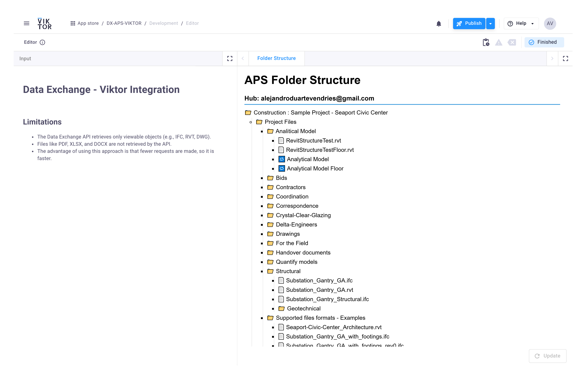

# DX-APS Viktor

Generates a static HTML view of Autodesk hubs/projects/folder trees using the Autodesk Data Exchange API and displays it in a Viktor WebView.

## How it works
- CRUD ([app/crud.py](app/crud.py)): Performs API queries (get_hubs, get_projects, get_top_folders, get_folder_tree) against APS Data Exchange.
- Orchestration (app/data_exchange.py): Recursively builds full folder trees per project (`build_folder_tree_recursively`), prints an ASCII tree for debugging, and returns a structured hierarchy via `get_all_content_from_all_hubs`.
- Models (app/models.py): Pydantic models (e.g., `DXFolderTree`, `HubData`, `ProjectData`) capture responses; `serialize_folder` converts models to JSON-serializable dicts.
- App (app/app.py): Obtains OAuth2 token, collects content, serializes to JSON, and injects it into `FolderBrowser.html` for a static client-side view in Viktor.

## Limitations
- Only viewable objects (IFC, RVT, DWG, etc.) are retrieved.
- Files like PDF, XLSX, DOCX are not retrieved by the API.
- Fewer requests than full listing, so faster, but not exhaustive.
